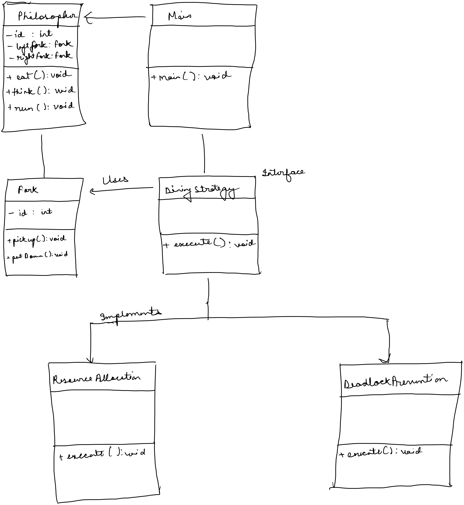

# Dining Philosopher's Problem
#multithreading #java


## Description of the Problem

- Imagine 5 philosophers dining around a round table
- Each of the 5 philosopher has a bowl of noodles
- There is a fork between each 2 philosopher
    - So there are 5 forks.
- A philosopher needs 2 forks to eat the noodles and always has to pick left fork before right fork.
- The challenge is for the philosophers to eat without starving themselves


## Major Concerns in this Problem

- **Deadlock**
    - This occurs when each philosopher holds one fork, and waits indefinitely for the other.
    - This creates a `circular wait condition`
- **Starvation**
    - This occurs when one or more philosopher never gets to eat because some other philosopher always picks the fork.
    - This is similar to `thread starvation`, where a thread never gets scheduled because other thread keeps getting locks on the resource.
- **Concurrency**
    - Managing concurrent access to shared resources without causing a deadlock situation


## Why are there so many solutions

- This problem is an abstraction of real-life concurrency issues faced in multithreaded computer system designs.
- Due to above nature of the problem, it makes it a good example to explore different synchronisation and concurrency-control mechanisms.
- Each solution highlights different strategies and trade-offs in shared resources.

### Resource Allocation Strategies
- In this strategy, the allocation of resources is controlled via a mechanism.

### Deadlock Prevention
- Preventing Deadlocks via preventing circular wait conditions.

### Fairness and Avoiding Starvation
- Ensuring all threads get fair share of resources.


## Class Diagram and Package Structure

### Class Diagram
- 

### Package Structure

- Package structure that will be used, is different from traditional Spring Boot package structure which is tailored for MVC pattern.
- Pattern used here has the purpose to solve problems like Dining Philosopher's problem, and other such problems.
  - Consider the problem can be solved using various strategies. In that case, the package structure will be something like this

```lua 
    - Multithreading/
      - core
        - Philosopher.java
        - Fork.java
      - strategies
        - DiningStrategies.java
        - impl
          - ResourceAllocationStrategyImpl.java
          - DeadlockPreventionStrategyImpl.java
      - main
        - Main.java
```

- Explaining Package Structure
  - **Core**
    - Contains essential entities related to the problem
      - Like Philosopher and Fork in this case
    - It can contain both class and interface.
      - Can keep the interface and impl structure from MVC if needed
  - **Strategy**
    - This encapsulates various algorithms used to solve the problem.
    - The class can be structured in interface and related impl files if necessary.
  - **Main**
    - This is the entry point into the application
    - It interacts with classes which are essential in setting up the POJOs and get the program up and running


## Implementation Notes

- **Philosopher Interface** - Outlines basic actions of a Philosopher (eating and thinking)
- **Fork Class** - Could be used for `Lock` if necessary
- **DiningPhilosopher Abstract Class** - This implements `Philosopher` interface and uses `DiningStrategy` for the specific logic related to picking up forks and eating.
- **DiningStrategy Interface** - Each solution implements this interface, encapsulating unique strategy for each approach.
- **Main Class** - Entry Point. Classes setup and what not.


## Working towards a Solution

- Define `Philosopher` and `Fork` with minimal requirements of the behaviour
- Define `DiningPhilosopherImpl` abstract class that all specific philosopher classes will extend
- Define `DiningStrategy` and implement all the solutions(ResourceAllocation and DeadlockPrevention)


